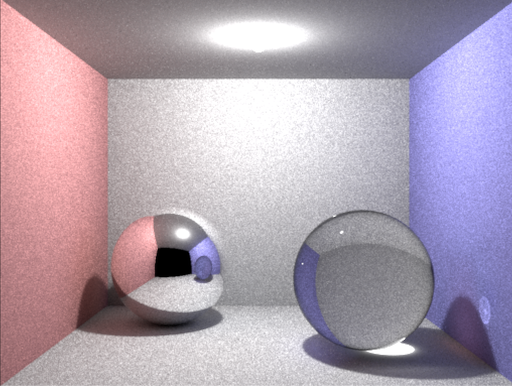
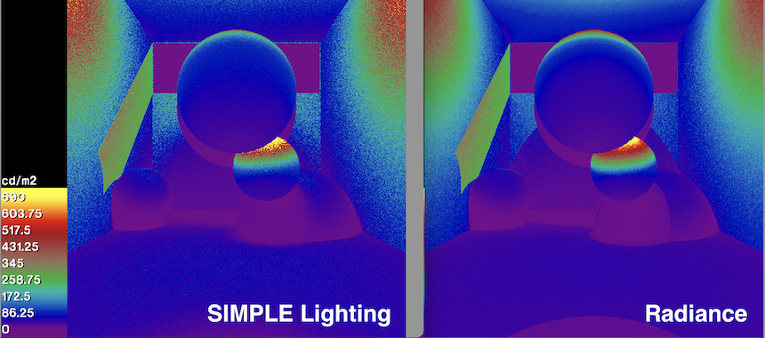

# Welcome


[](https://codecov.io/gh/SIMPLE-BuildingSimulation/rendering)


This is a library that intends to help developing Physically Based rendering engines **that can be used for daylight simulation**. The results seem to be OK when comparing
against [Radiance](https://www.radiance-online.org), but it is still slower than it.


## Documentation

Check the Rust documentation [HERE](https://simple-buildingsimulation.github.io/rendering/)

## Some examples






## Rust features
* `default`: Uses `f64` by default and does not run on parallel.
* `parallel`: Enables [Rayon](https://docs.rs/rayon/latest/rayon/) for running  ray-tracing processes in parallel.
* `float`: Switches the default floating point number to `f32`


## Building and testing

At present, some bits are using [`std::simd::Simd`](https://doc.rust-lang.org/nightly/std/simd/struct.Simd.html), so you need to setup the `nightly` toolchain for this.

```bash
# Just for this project
rustup override set nightly

# Or, for all your projects
rustup default nightly
```

I recommend using this command for building, which enables parallelism.

```bash
cargo build --release --features parallel
```

Then, run the unit tests as follows (we need more coverage... it is kind of hard
to design tests for this, I have found)

```bash
cargo test
```

Render some pre-built scenes (they'll end up in `./test_data/images/`)

```bash
cargo test --features parallel --release --package rendering --test test_scenes -- --ignored 

```

